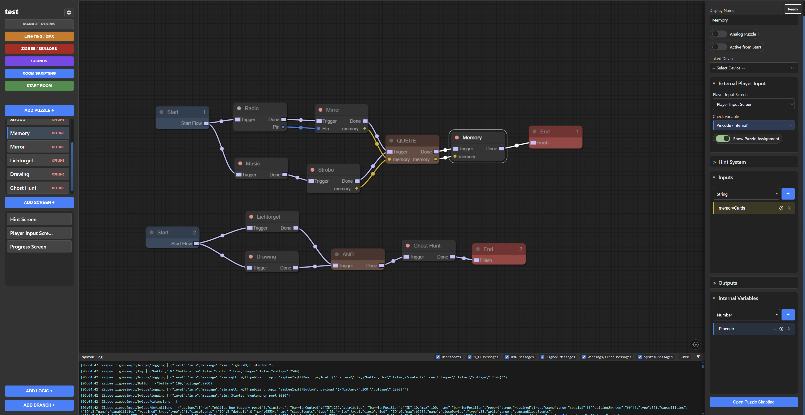
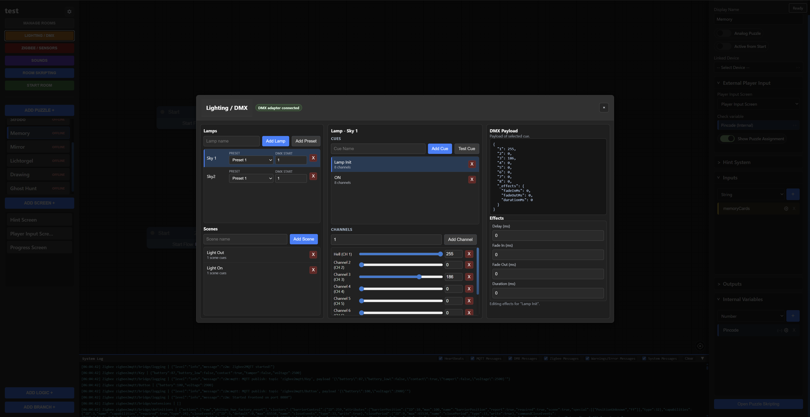
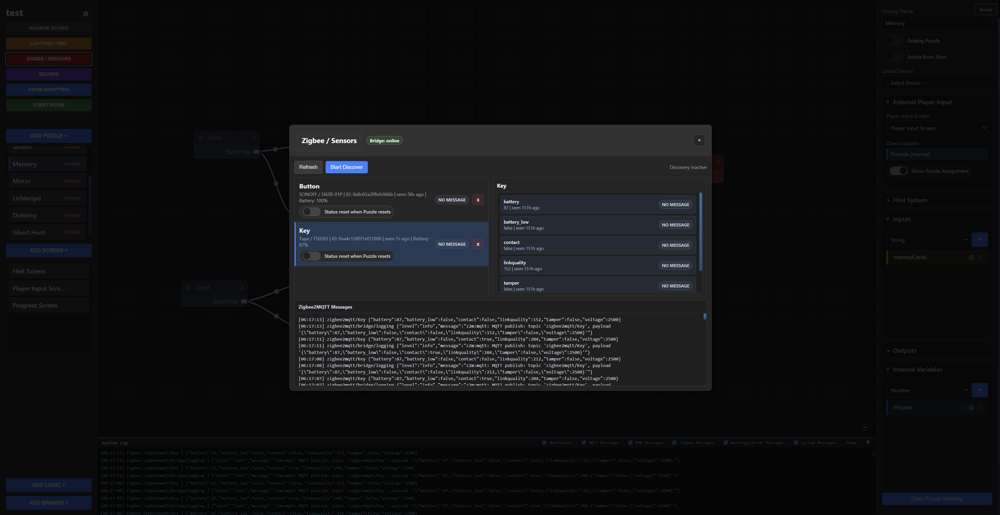
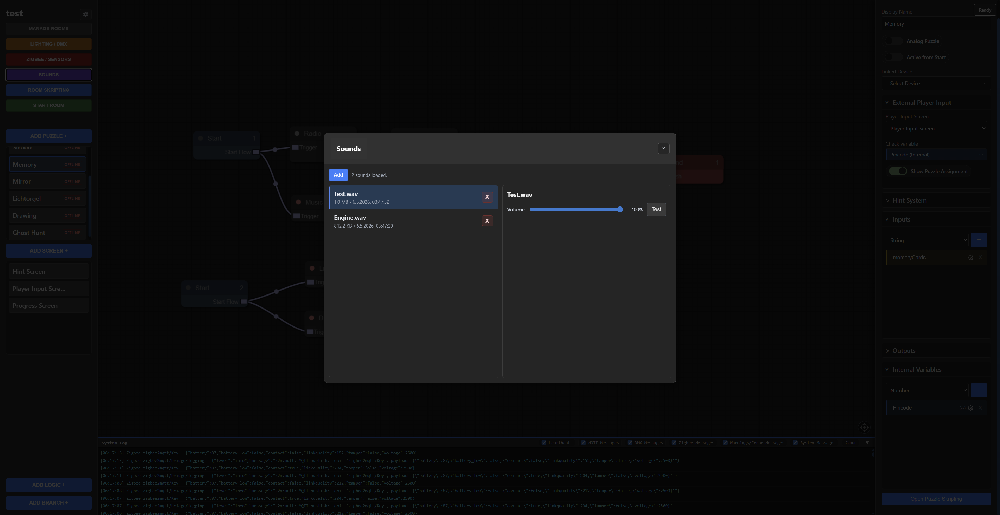
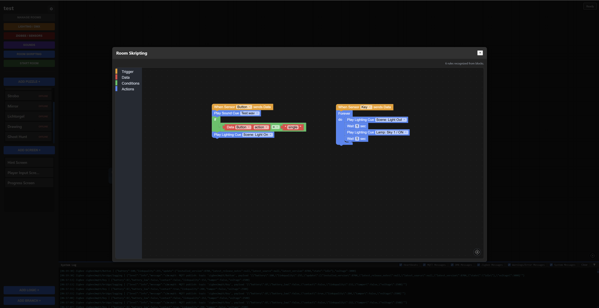
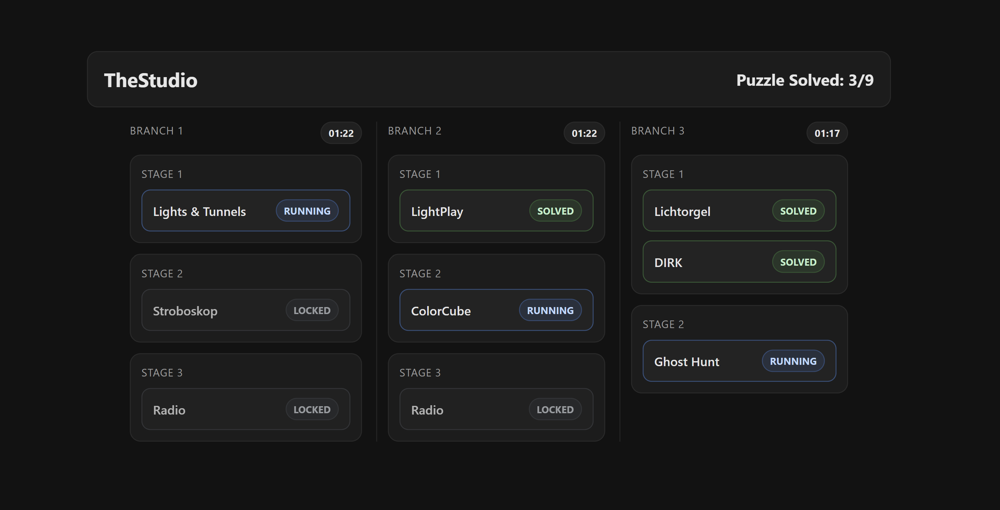
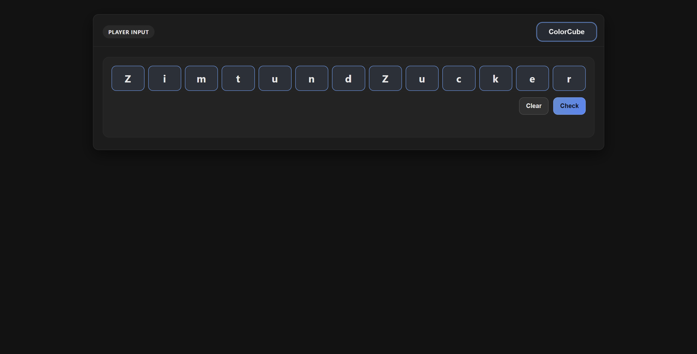
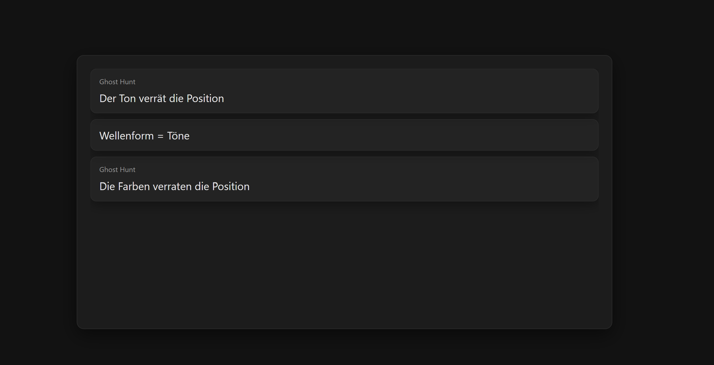

# EscapeHub - Escape Room Control System

EscapeHub is a **local web application** for controlling and managing **escape room rooms, puzzles, sensors, lighting, sounds, and screens**.

The system is typically deployed on a **Raspberry Pi** and connects several components: digital puzzle clients, Zigbee sensors, DMX fixtures, sound output, player screens, and a visual scripting interface.

---

## Overview

EscapeHub provides a central interface for configuring, starting, monitoring, and operating an escape room installation.

Supported features include:

* Room and branch management
* Visual puzzle graph
* Blockly scripting for room and puzzle logic
* Zigbee2MQTT sensor integration
* DMX/OLA lighting control
* Sound cues with upload and per-sound volume control
* Hint, player, and progress screens
* Communication with external puzzle clients via MQTT and HTTP
* System settings for services, USB devices, audio, and screens

---

## Screenshots

### Room Editor



### Feature Views

| Lighting / DMX | Zigbee / Sensors |
| --- | --- |
|  |  |

| Sounds | Room Scripting |
| --- | --- |
|  |  |

| Progress Screen | Player Input Screen |
| --- | --- |
|  |  |

| Hint Screen |
| --- |
|  |

---

## Project Structure

```text
MD2-ProjektB/
|
|-- HubRemoteEditing/
|   |-- Server/                 # Express server, static hosting, uploads, sound API
|   |-- src/
|   |   |-- engine/             # Runtime logic, game loop, MQTT, SQLite
|   |   |-- routes/             # API routes
|   |
|   |-- public/                 # Web UI, editor, screens, CSS, vendor libraries
|   |-- PuzzleTemplates/        # Templates for external puzzle clients
|   |-- MediaStorage/           # Local uploaded media files, ignored by Git
|   |-- SoundStorage/           # Local uploaded sounds, ignored by Git
|   |-- rooms/                  # Local room data, ignored by Git
|   |-- escape.db               # Local SQLite database, ignored by Git
|
|-- RadioRemoteEditing/         # separate/older radio puzzle codebase
|-- README.md
```

---

## System Requirements

The hub is designed for Raspberry Pi based installations.

Required components:

* Node.js
* Mosquitto MQTT broker
* Zigbee2MQTT, if Zigbee sensors are used
* OLA / `olad`, if DMX is used
* ALSA audio tools, for example `amixer` and `aplay`
* Optional: `ffplay`, `mpv`, `paplay`, or `mpg123` for sound playback
* USB DMX adapter, for example DMXking ultraDMX Micro
* Zigbee dongle, for example Sonoff Zigbee 3.0 USB Dongle Plus V2

---

## Installation on Raspberry Pi

These steps describe a fresh Raspberry Pi OS installation on a real Raspberry Pi.

### Automatic Setup

Clone the repository:

```bash
git clone https://github.com/<your-user>/<your-repo>.git
cd EscapeRoomHub
```

If your checkout contains the `HubRemoteEditing` folder as a subdirectory, enter it:

```bash
cd HubRemoteEditing
```

Run the installer:

```bash
sudo bash install.sh
```

Choose `Install core hub` for a hub-only setup or `Install full setup` for guided hardware setup.

For a non-interactive install, run:

```bash
sudo bash install.sh --core
```

Use `--core` for development, demos, VMs, or installations where Zigbee/DMX/audio hardware is not configured yet.

For the full installer path, run:

```bash
sudo bash install.sh --full
```

Use `--full` for a Raspberry Pi that should run the complete room setup. It runs the core install and then performs guided setup for:

* Zigbee2MQTT
* stable `/dev/zigbee` udev rule
* OLA / DMX
* stable `/dev/dmx` udev rule
* USB audio default device and mixer volume

The hardware steps are interactive. The installer asks before binding detected USB serial devices to `/dev/zigbee` or `/dev/dmx`.

Use `--core` when you only need the hub server and MQTT. Use `--full` for production-like Pi installations where the Zigbee dongle, DMX adapter, and audio device are connected.

The installer installs system dependencies, Node.js 20 LTS, Node.js packages, Mosquitto MQTT, runtime folders, and a `md2-hub` systemd service.

It also configures Mosquitto for local-network puzzle clients:

```conf
listener 1883 0.0.0.0
allow_anonymous true
```

This is intended for a trusted local escape-room network. Do not expose this MQTT port to the public internet.

After setup, open:

```text
http://<raspberry-pi-ip>
```

Useful service commands:

```bash
sudo systemctl status md2-hub --no-pager
sudo journalctl -u md2-hub -f
sudo systemctl restart md2-hub
bash install.sh --doctor
```

For hardware setup, run `sudo bash install.sh --full` with the Zigbee dongle, DMX adapter, and audio device connected.

### Manual Setup

Install the required base packages:

```bash
sudo apt update
sudo apt install -y git curl ca-certificates python3 make g++ build-essential
```

Install a current Node.js LTS version. This also installs `npm`:

```bash
curl -fsSL https://deb.nodesource.com/setup_20.x | sudo -E bash -
sudo apt install -y nodejs
```

Check installed versions:

```bash
node -v
npm -v
```

Clone the repository:

```bash
git clone https://github.com/<your-user>/<your-repo>.git
cd EscapeRoomHub
```

If your checkout contains the `HubRemoteEditing` folder as a subdirectory, enter it:

```bash
cd HubRemoteEditing
```

Enter the server directory and install Node.js dependencies:

```bash
cd Server
npm install
```

Start the hub:

```bash
sudo node server.js
```

The web interface is then available at:

```text
http://escapehub.local
```

or directly via the Raspberry Pi IP address:

```text
http://<hub-ip>
```

The server uses port `80` by default.

If `npm` is not available, Node.js was not installed correctly. Re-run:

```bash
sudo apt install -y curl ca-certificates
curl -fsSL https://deb.nodesource.com/setup_20.x | sudo -E bash -
sudo apt install -y nodejs
```

Check installed versions:

```bash
node -v
npm -v
```

For production use on the Pi, run EscapeHub as a systemd service instead of starting it manually. The service should execute:

```bash
/usr/bin/node /home/admin/md2-hub/Server/server.js
```

Adjust the path to match your installation directory.

---

## System Services

EscapeHub works with several Linux services.

Check service status:

```bash
sudo systemctl status md2-hub
sudo systemctl status mosquitto
sudo systemctl status zigbee2mqtt
sudo systemctl status olad
```

Restart services:

```bash
sudo systemctl restart md2-hub
sudo systemctl restart zigbee2mqtt
sudo systemctl restart olad
```

---

## USB Device Mapping

Zigbee and DMX should not be configured directly through changing paths such as `ttyUSB0` or `ttyUSB1`.

Use stable symlinks instead:

```text
/dev/zigbee
/dev/dmx
```

Example Zigbee2MQTT configuration:

```yaml
serial:
  port: /dev/zigbee
  adapter: ember
```

Example OLA configuration:

```ini
enabled = true
device = /dev/dmx
device_dir = /dev
device_prefix = dmx
ignore_device = /dev/zigbee
```

This prevents OLA from accidentally opening and blocking the Zigbee dongle.

---

## Web Interface

The main interface contains these areas:

* **Room Editor**: puzzle graph and room structure
* **Zigbee / Sensors**: sensor list, latest messages, and triggers
* **Sounds**: upload, test, and per-sound volume
* **Room Scripting**: Blockly rules for room logic
* **Puzzle Scripting**: Blockly rules for individual puzzles
* **Lighting / DMX**: fixtures, presets, cues, and scenes
* **Running Room Screen**: live status, logs, and puzzle states
* **System Settings**: services, screens, audio, DMX, Zigbee, and autostart

---

## Puzzle Communication

External puzzles communicate with the hub through the included Communication Agent templates.

The templates use MQTT internally. For puzzle logic, they expose simple HTTP calls.

Typical flow for a digital puzzle:

1. Read state from the hub
2. React to `reset`, `running`, or `solved`
3. Set outputs or custom values
4. Set state to `solved` when the puzzle is solved
5. Send heartbeat/status regularly or on state changes

Templates are located here:

```text
HubRemoteEditing/PuzzleTemplates/
|-- Mikrocontroller/
|-- Windows, Linux, Pi/
```

---

## DMX and Lighting

The lighting system manages fixtures, cues, and scenes.

Supported features:

* Fixtures with presets or custom channels
* Cues with DMX values
* Cue effects such as delay, fade in, fade out, and duration
* Scenes with multiple cues, parallel cues, and delays
* Nested scenes
* Test cue and test scene
* Script action `Play Lighting Cue`

Important:

```text
duration = 0
```

means that a cue stays active indefinitely. It ends only when it is replaced by another cue, stopped by a test stop, or stopped when the room closes.

---

## Sounds

Sounds can be uploaded and tested in the Sounds tab.

Behavior:

* System volume is set to 100 percent when the hub starts
* Each sound has its own volume setting in the hub
* New sounds default to 50 percent
* Sounds can be played from Blockly scripts with `Play Sound Cue`
* Running sounds are stopped when the Sounds window closes or when the room closes

---

## Data Storage

The main project data is stored in SQLite:

```text
HubRemoteEditing/escape.db
```

Important tables:

* `rooms`
* `devices`
* `config`
* `puzzle_solutions`

Uploads are stored as local files in:

```text
HubRemoteEditing/MediaStorage/
HubRemoteEditing/SoundStorage/
HubRemoteEditing/public/uploads/
```

These runtime files are intentionally ignored by Git.

---

## Diagnostics and Debugging

Hub logs:

```bash
journalctl -u md2-hub -f
```

Zigbee2MQTT:

```bash
journalctl -u zigbee2mqtt -f
mosquitto_sub -h localhost -t 'zigbee2mqtt/#' -v
```

DMX / OLA:

```bash
journalctl -u olad -f
ola_dev_info
ola_set_dmx -u 0 -d 255,0,0,0
```

Audio:

```bash
cat /proc/asound/cards
aplay -L
amixer -c UC02 sget PCM
speaker-test -D plughw:CARD=UC02,DEV=0 -c 2 -t wav -l 1
```

USB devices:

```bash
ls -l /dev/zigbee /dev/dmx
readlink -f /dev/zigbee
readlink -f /dev/dmx
sudo lsof /dev/zigbee /dev/dmx
```

---

## Operating Notes

* Connect the Zigbee dongle directly to the Raspberry Pi or through a short USB extension.
* Always configure DMX and Zigbee through `/dev/dmx` and `/dev/zigbee`.
* OLA must scan only the DMX adapter.
* Zigbee2MQTT must have exclusive access to the Zigbee dongle.
* System volume stays at 100 percent; sound cue volume is controlled in the hub.
* After USB changes, verify that the symlinks still point to the correct devices.

---

## Known Pitfalls

* If Zigbee2MQTT reports `Device or resource busy`, another service is usually holding the Zigbee port.
* If OLA opens the wrong port, check `ola-usbserial.conf` and the active OLA plugins.
* If DMX does not send, check `ola_dev_info` and universe `0` first.
* If audio volume differs on first playback, check the system mixer and the selected playback backend.
* If `escapehub.local` does not resolve, use the IP address directly.

---

## License

This project is **source-available for non-commercial use only**.

You may clone, use, modify, and share this project for private, educational, experimental, research, and other non-commercial purposes.

Commercial use is not permitted without prior written permission from the copyright holder.

License:

```text
PolyForm Noncommercial License 1.0.0
```

See [LICENSE](LICENSE).

Note: Because commercial use is excluded, this project is not licensed as OSI-compliant open source software. It is source-available non-commercial software.

---

## Context

This project was developed for a Media Design 2 escape room project.

It is a project-specific control hub for escape room installations and is not structured as a generic product package.
